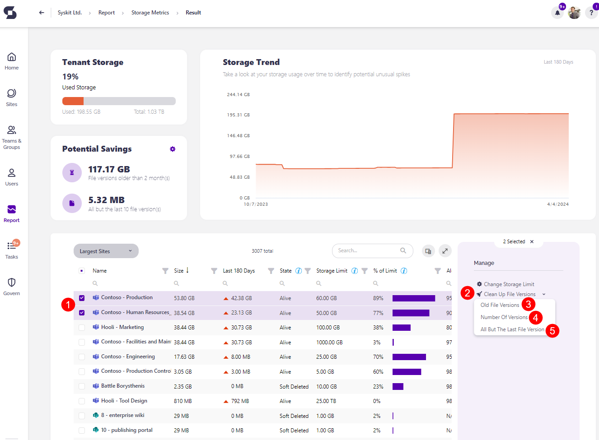
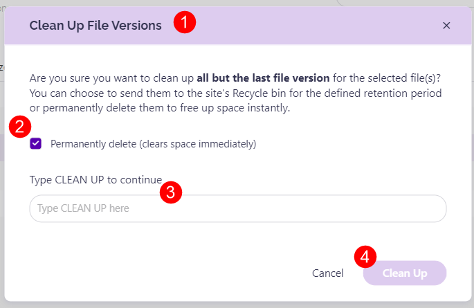
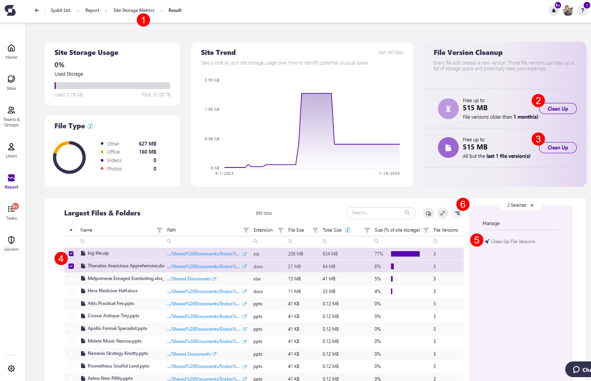
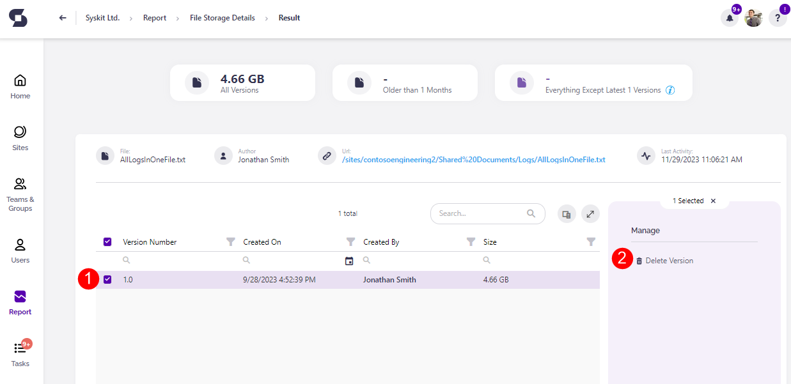

# Free Up Storage


**Please note!** If a certain site **has a hold or retention policy applied**, the Clean Up Storage action fails for that workspace, and storage is not freed. If a certain file has a hold or retention policy applied, that file is not cleaned up or deleted. 


Regularly cleaning up older file versions is the best way to optimize performance, improve collaboration, increase cost efficiency, and ensure better data security. 

In Syskit Point, there are several ways you can free up space and complete the clean up action. 

## Clean Up Action on Storage Metrics report

**The Storage Metrics report** is where you can complete a bulk clean up action. The report can be generated in the following way:
 
 * **Click the View All** button on the Storage tile located on the dashboard.
   * Alternatively, **click the Reports button** located on the left side of the screen, **select Storage** from the dropdown filter, and **click the Storage Metrics report**.

Once the Storage Metrics Report is generated, complete the next steps: 

  * **Select one or more sites (1)** you want to remove storage from. 
  * **The Clean Up File Versions action (2)** is now available on the right side of the screen.
  * **Clicking the arrow** next to the Clean Up File versions action provides several clean up actions:
    * **Old File Versions (3)** - lets you clean up old file versions based on the value you set up in Settings.
    * **Number of File Versions (4)** - lets you clean up several old file versions based on the value you set up in Settings.
      * For more details on setting up these values, look at the [Configure Storage Management article](../setup/configuration/configure/configure-storage-management.md).
    * **All but the last file versions (5)** - lets you clean up all versions of the files, except for the most recent one. Clean Up Action on Site Storage Metrics Report


**Please note**: Completing the cleanup action from the Storage Metrics report cleans up all files located at the selected site or sites. Freeing up space from one specific file or files on the site is possible from the [Site Storage Metrics](#clean-up-action-on-site-storage-metrics-report) and [File Storage Details](#clean-up-action-on-site-storage-metrics-report) reports.


* **Clicking any of the Clean Up options opens the Clean Up File Versions pop-up (1)**
  * The information on the pop-up slightly varies depending on whether you're cleaning up file versions older than X months, cleaning up all but the last X file versions, or cleaning up all but the latest file version; however, the options available for the clean up are the same.
* To premanantly delete the file(s), check the **Permanantly delete checkbox (2)**; doing this instantly frees up space for your site.
    * If the checkbox is not selected, the file(s) are sent to the site's Recycle bin for the defined retention period; doing this does not instantly free up space for your site, and the space is only cleared once the file(s) are removed from recycle bin. 
* **Type Clean Up (3)** in the the available space to proceed.
* **Click the Clean Up button (4)** to finalize. 

## Clean Up Action on Site Storage Metrics report

You can complete the clean up action from the Site Storage Metrics report by doing the following: 
  * When the Storage Metrics Report is generated, **click the name of the site** you want to remove storage from. This opens the **Site Storage Metrics report**.
  * **Click the Report button** on the left of the screen and **select Storage from the dropdown menu**. There, you can **click the Site Storage Metrics report** to access it. 

There are three ways to clean up the storage space across your sites. 

 * In the File Version Cleanup tile, you can:
   * **Choose to Clean Up file versions older than X month(s) (2)**
   * **Choose to Clean Up all but the last X file version(s) (3)**
     * The exact numbers shown here can be customized in your Syskit Point settings; for more details on this, take a look at the [Configure Storage Management article](../setup/configuration/configure/configure-storage-management.md)

  * **Selecting the site (4)**, or the files included in the site and clicking the **Clean Up File Versions button (5)**, located on the right side of the screen under the **Manage section**. 

Once you click the **Clean Up button** on the File Version Cleanup tile or the **Clean Up File Versions button** in the Manage section, a **Clean Up File Versions pop-up opens (1)**.
  * To permanently delete the file(s), check the **Permanantly delete checkbox (2)**; doing this instantly frees up space for your site.
    * If the checkbox is not selected, the file(s) are sent to the site's Recycle bin for the defined retention period; doing this does not instantly free up space for your site, and the space is only cleared once the file(s) are removed from recycle bin. 
  * **Type Clean Up (3)** in the the available space to proceed.
  * **Click the Clean Up button (4)** to finalize.


**Please note**: If you do not permanently delete files, they are sent to the site's Recycle bin for the defined retention period. The retention period for your site's Recycle bin depends on the period you previously defined in SharePoint. For more details on this, [take a look at this Microsoft 365 article.](https://support.microsoft.com/en-us/office/manage-the-recycle-bin-of-a-sharepoint-site-8a6c2198-910e-42dc-9a9c-bc5bc4f327da)



## Clean Up Action on File Storage Details report

You can complete the cleanup on the File Storage details screen as well. To navigate there, repeat the above steps until you reach the Site Storage Metrics report. 

From there:

 * Under the Largest Files & Folders section and **click the name of the file** you want to generate the File Details report for.
 * Once the report is generated, **select one or more of the file versions (1)**, and the **action to Delete Version (2)** is then available on the right side of the screen under the **Manage section**. 


**Hint!** The latest version is never deleted, even if you select all versions and run the Delete Version or Clean Up File Versions action.


You can also manage storage directly from SharePoint by clicking the **link in the Storage Metrics URL column**. 
  * The SharePoint site-specific Storage Metrics report opens in your browser.
