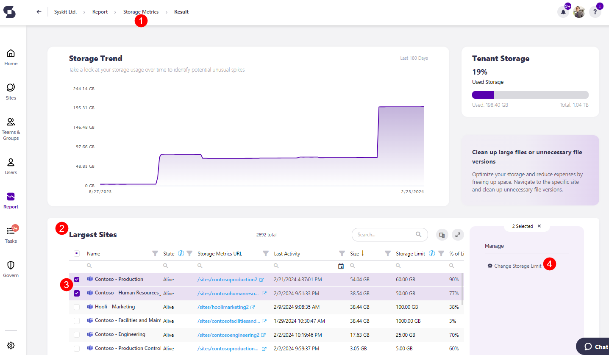
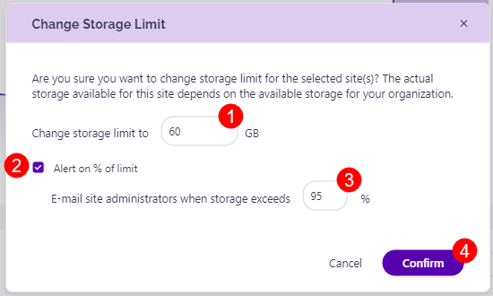

# Limit Storage Usage

An important part of Storage Management for SharePoint Online is limiting and keeping track of your storage usage.

This can be done by enabling the [Tenant Storage Limit policy](../governance-and-automation/automated-workflows/tenant-storage-admin.md). The policy can be automated, which means you'll [receive tasks](../point-collaborators/resolve-governance-tasks/tenant-storage-limit.md) based on the parameters you set up for the policy. When the policy is not automated, your tenant storage limit is still detected and used for the Security & Compliance checks. That way, you can still stay on top of the state of your tenant's storage without receiving tasks sent to you via email. 

Another way to ensure that your storage has been fully utilized is by manually setting your site storage limits within Syskit Point.


**Please make sure** you have enabled the manual setting of site storage limits through SharePoint. For detailed instructions, [take a look at this article.](../faq/site-storage-limits.md)


Once manual editing for site storage limits is enabled, you can now change your site storage limits directly through Syskit Point.

Some sites might be smaller and require a small amount of storage, while other, larger sites have an increased need for storage. The change site storage limits feature allows you to increase or decrease the storage limit for sites based on their individual requirements.

The only thing you need to keep in mind is that the cumulative storage for all your sites **cannot exceed the total tenant storage** you have available. 

## Change Site Storage Limits

In your Syskit Point, you can either click the **View All button on the Storage tile** directly on the Dashboard, or alternatively, you can click the **Reports button** on the left side of the screen, select Storage Management from the drop-down menu and click the **Storage Metrics report (1)**. 

 * Once the Storage Metrics report has been generated, navigate down to the **Largest Sites section (2)**. 
 * **Select one or multiple sites (3)** you want to change the storage limits for 
 * **Click the Change Storage Limit button (4)**, located on the right side of the screen under the Manage section.
   * This opens the Change Storage Limit pop-up. 

Here, you can set the following:

 * **Input the number of GB (1)** you want this site to have as a limit.
 * **Select the checkbox (2)** if you want to be alerted when the site reaches a certain percentage limit.
   * Selecting the checkbox also provides the option to **select what percentage of storage (3)** should the site exceed for administrators to be notified. 
 * **Click Confirm (4)** to finalize your selection.

 

**Please remember** that the **total storage limit for all your sites cannot exceed the total storage available for your tenant**. Make sure you divide the storage across the sites in a way that will help you maximize the usage.  


