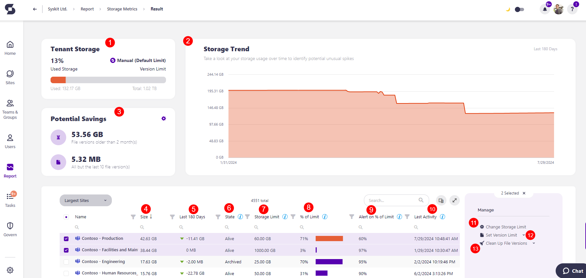

# Storage Management for SharePoint Online 

## The Importance of Storage Management in Microsoft 365

**Storage management in Microsoft 365 isn't just a routine task - it's a strategic necessity.** 

Here's why you should maintain an active approach to your Storage Management:

  * **Your monthly expenses are directly linked** to the efficiency of your storage management, particularly within SharePoint sites connected to your organization's purchased licenses.
  * When you run out of storage for your SharePoint sites, depending on your plan, you would have to use the Office 365 Extra File Storage add-on to **buy more storage** in 1GB increments. 
 * **The best thing you can do to avoid additional costs is to clean up your storage proactively** and use tools that are available to manage and optimize the usage of your storage.

[For more details about site storage limits, take a look at this article.](../faq/site-storage-limits.md)

## Storage Management in Syskit Point

To start with your Storage Management, make sure it's configured based on your preferences within Syskit Point.

That's where you can set up certain metrics that help you clean up your storage, such as how many versions of a file you want to keep or how old files should be before you delete them. 

Here's how to get started with your storage management in Syskit Point: 

  * [The first step is to configure your environment for Storage Management, so take a look at this article.](../setup/configuration/configure/additional/configure-point-for-storage-management.md) Please note, **this is only needed for the Syskit Point Data Center customers**. You can skip this step if you are using the Syskit Point Cloud.
  * Make sure to [read through the Configure Storage Management within Syskit Point article.](../setup/configuration/configure/additional/configure-storage-management.md) 
  * Next, it's time to configure your [Tenant Storage Limit Policy](../governance-and-automation/automated-workflows/tenant-storage-admin.md). This policy is used to detect and monitor your storage, but if you choose to, you can also enable task delegation.  
 * Once the policy has been edited based on your preferences, you can [take a look at the Tenant Storage Security & Compliance Check article](../governance-and-automation/security-compliance-checks/tenant-storage.md) to see all the details and information you can get from this policy being detected in your environment.

Now that we've covered how to begin utilizing your storage management within Syskit Point let's look into the valuable information and actions that can be taken from the Storage Metrics reports.

### The Storage Metrics Reports

The [Storage Metrics report](../storage-management/storage-reports.md#storage-metrics) is available in the latest Syskit Point version and helps you:
* **Discover the percentage of used storage in your tenant (1)**
* **Observe the trend of your storage usage over time (2)**
* **See the Potential Savings for how much storage you can save(3)**
  * You can clean up File versions older than X months or All but the last X number of file versions 

You can also find the most important storage-related information for the largest sites:
* **Size (4)** - storage used up by the SharePoint site
* **Last 180 Days (5)**; shows the storage trend for a site during this period of time along with an arrow that signifies the growth or reduction, and hovering above it gives you a percentage by how much.
   * By default, the Last 180 Days column is shown on the report but the following views are also available: **Largest Growth in last 7 days, Largest Growth in last 30 days, Largest Growth in last 90 days**.
* **State (6)** - current state of the site 
* **Storage Limit (7)**
    * Storage limit defined per site
    * By default, set in SharePoint to 25TB if not otherwise defined manually for the observed site; 25TB represents the pool of total available storage, although the actual size of available storage can be smaller, depending on the number of purchased licenses
    * Storage Limit for soft deleted sites is set to = KB
* **% of Limit (8)** - shows the percentage of the site's size in the defined site storage limit
* **Alert on % of Limit (9)** - shows the site's defined percentage limit when email notifications are sent to owners
* **Last Activity (10)** - shows the date and time of the site's last activity

Selecting one or more sites provides the following actions:
  * **Change Storage Limit (11)** - lets you change the storage limit for sites.
    * [For more details on how to set different storage limits, take a look at the Limit Storage Usage article.](../storage-management/limit-storage-usage.md)
  * **Set Version Limit (12)** - lets you set up a limit on the file versions kept per site based on your settings and preference.
    * [For more details how to set up versioning limits, take a look at the Storage Versioning Limits article.](../storage-management/versioning-limits.md)
  * **Clean Up File Versions (13)** - lets you clean up old file versions, several file versions, or all but the last file version.
    * [For more details on all of the ways you can complete the Clean Up File action, take a look at the Free Up Storage article.](../storage-management/free-up-storage.md)

Once you detect the largest sites with the help of the Storage Metrics report, you can **click the name of the site** to open the site-specific Storage Metrics report.

Along with the Storage Metrics report, you can access the following Storage reports:
* [Site Storage Metrics](../storage-management/storage-reports.md#site-storage-metrics); shows site storage usage over time, along with an overview of all files (and types of files) stored on the site and the option to clean up older file versions.
* [File Storage Details](../storage-management/storage-reports.md#file-storage-details); shows how much storage is used by a file as well as an overview of all file versions still stored and the ability to remove the older or unused file versions.

With the help of these reports, you can:

 * Gain deeper **insight into how your storage is used by specific file types**, such as videos, photos, office documents, and others. 

 * See how much **storage you can save per site** if you delete file versions older than a certain number of months or every file version except for the most recent one. 

 * **Complete the Clean Up File Versions action and free up space**. 

For more details on exactly what information can be found in the reports, [take a look at the Storage Reports article](../storage-management/storage-reports.md)

## Related Articles

* [Configure Your Environment for Storage Management](../setup/configuration/configure/additional/configure-point-for-storage-management.md)
* [Configure Storage Management](../setup/configuration/configure/additional/configure-storage-management.md)
* [Configure Tenant Storage Limit Policy](../governance-and-automation/automated-workflows/tenant-storage-admin.md)
* [Tenant Storage Security & Compliance Check](../governance-and-automation/security-compliance-checks/tenant-storage.md)
* [Resolve Tenant Storage Limit Task](../point-collaborators/resolve-governance-tasks/tenant-storage-limit.md)
* [Storage Metrics Report](../storage-management/storage-reports.md)
* [Site Storage Metrics Report](../storage-management/storage-reports.md#site-storage-metrics)
* [File Storage Details Report](../storage-management/storage-reports.md#file-storage-details)
