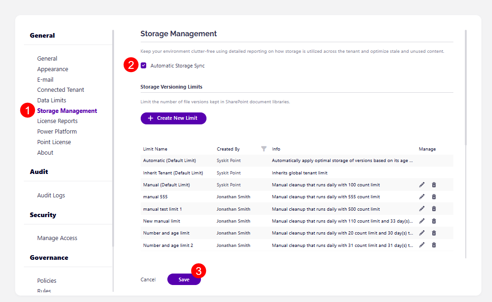
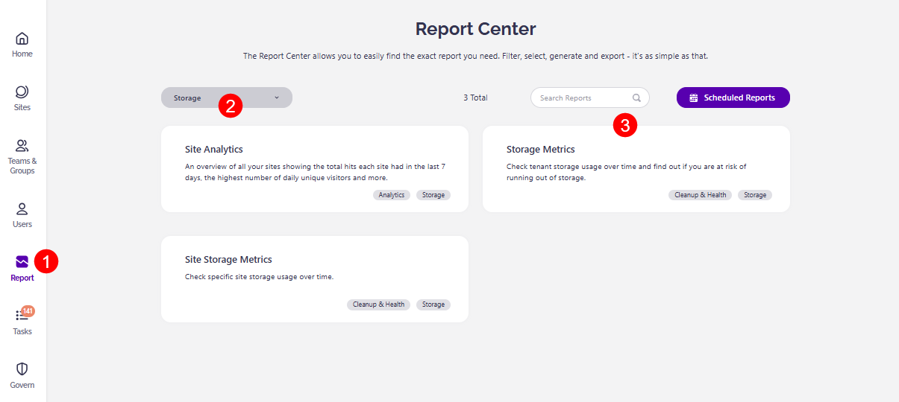
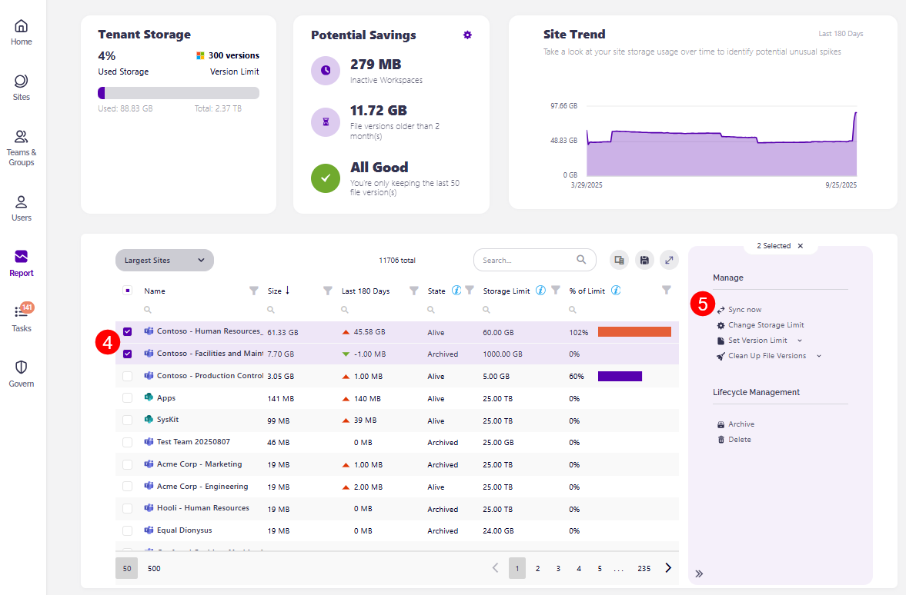
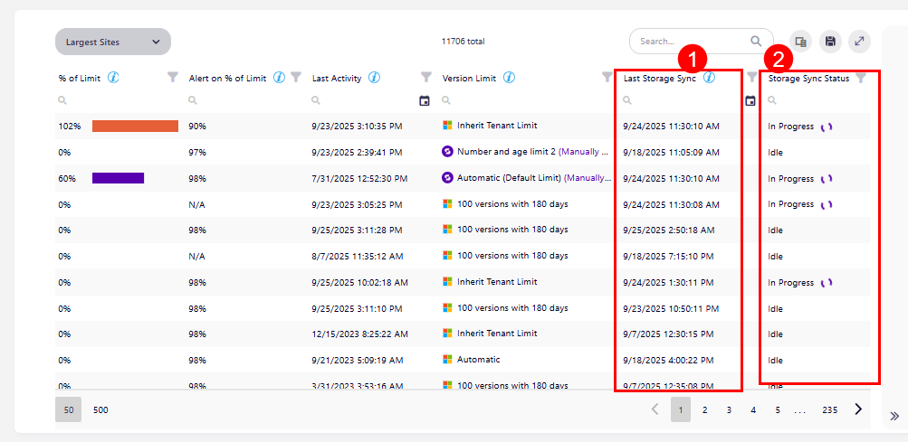
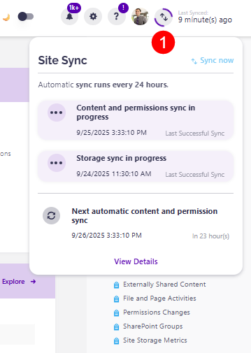

 
# Storage Sync
 
Storage Management helps organizations gain detailed insight into their storage usage all the way down to the file level. It provides you with an easy way to manage your storage through versioning limits, all while providing quick insight into your potential storage savings. 

If you've already set up everything you can for your storage management, you might be wondering how the storage sync works and when you'll see the changes reflected in Syskit Point. 

Certain metrics such as total storage used and total storage available are always accessible through Autodiscover sync and Site Sync. However, for more detailed storage insights, such as file-level details, the **Storage Sync** has to be completed. 

Syskit Point has two ways of collecting and updating your storage data: through **automatic storage sync**, or through **on-demand storage sync**. 

This article explains both, as well as situations where they might prove useful. 

## Automatic

The Storage Sync runs automatically whenever a **full site sync** occurs. This means that if there are any major changes on the workspace (such as structure, ownership, or sharing), the Storage Sync is triggered.

To ensure automatic storage sync is set up, please do the following: 

* In Syskit Point, go to the **Settings**
* Under General, **click Storage Management (1)**, which opens the Storage Management settings screen
* **Click the Automatic Storage Sync checkbox (2)** to ensure automatic storage sync is turned on
* **Click the Save button (3)** to store your settings

**Occasionally, there is a delay in storage sync, especially with large environments**, which means that file versions that were already deleted in SharePoint could still appear in reports until the next sync is completed.
  * Depending on the size of the environment, the storage sync can take **up to a month**.

In these instances, especially if you have a larger tenant, we recommend using **on-demand sync to target specific workspaces** instead of waiting for the full sync cycle to be completed.

 
## On-Demand 

The On-demand Storage Sync lets you manually trigger the Storage Sync for specific workspaces when needed.

This is recommended for **larger tenants** or if **the automatic storage sync is disabled** in the Settings. 

To start an on-demand storage sync for a workspace, please complete the following steps: 

* In Syskit Point, **click the Report button (1)** on the left side of the screen to access the Report Center
* **Select Storage (2)** from the top left side filter to view only storage-related reports
* From the available reports, **select the Storage Metrics report (3)**
  * For more details on this report, take a look at the [Storage Metrics report article](../storage-management/storage-reports.md#storage-metrics)
* **Select one or more workspaces (4)** you want to sync on the largest sites report
* On the right side, the **Sync Now button (5)** shows up
* **Clicking the Sync Now button (5)** immediately starts the sync process 

 
 
## Track Storage Sync

Whether your storage is being synced automatically or you've used the on-demand sync option, you can keep track of how the sync process is going and when a workspace's storage was last synced.

* On the **Storage Metrics report**, take a look at these two columns:
  * **Last Storage Sync (1)** - shows the date that reflects the last time a **full** sync with changes occured
    * Please note, it's normal to see an older date unless any major changes triggered a new automatic storage sync or a on-demand storage sync was recently performed
  * **Storage Sync Status (2)** - shows the current status of the storage sync

* Select a workspace on the [Sites Overview screen](../microsoft365-inventory/sites.md), which opens the **Workspace Details screen**
  * In the top right corner, if the storage is being synced, you can **view the current progress (1)** and see if there are any potential conflicts stopping a full storage sync.

