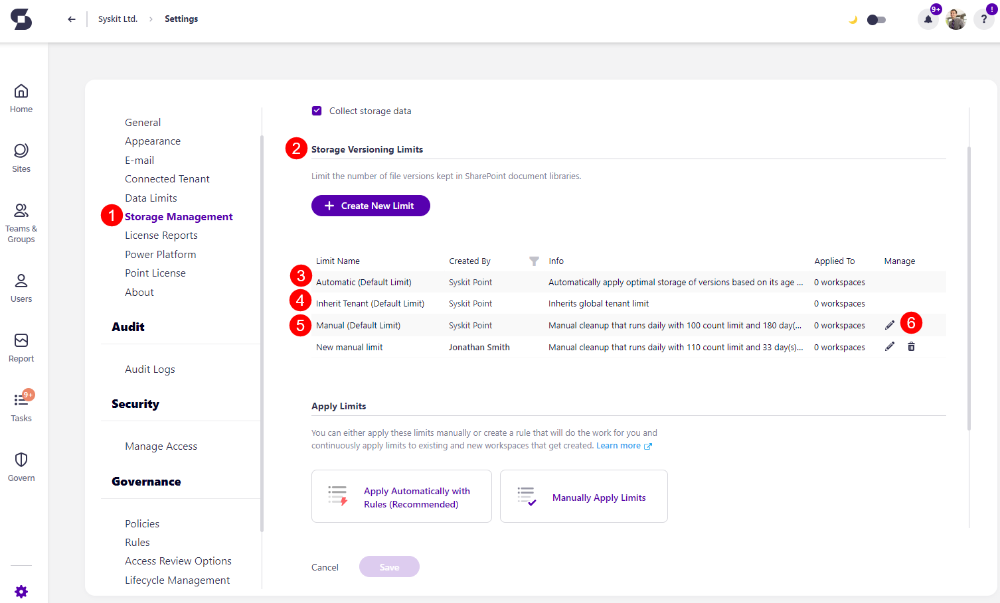
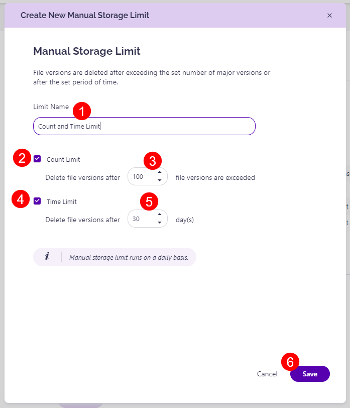
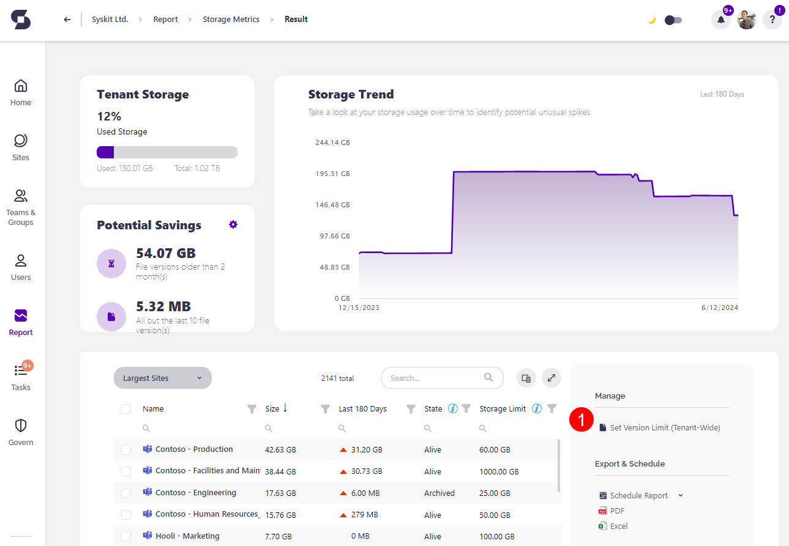
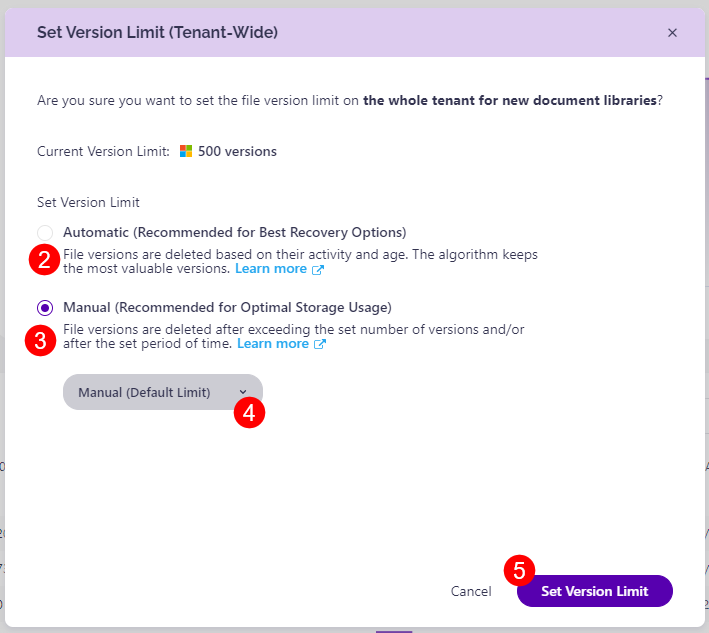
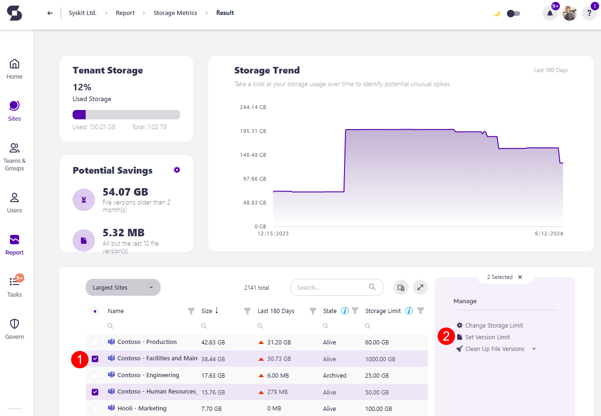
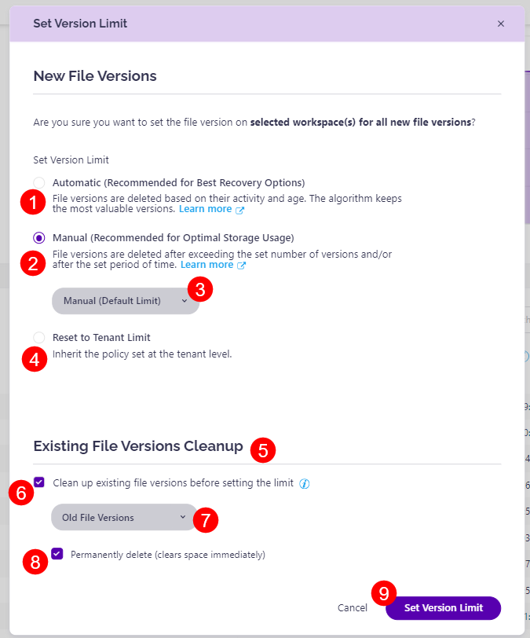
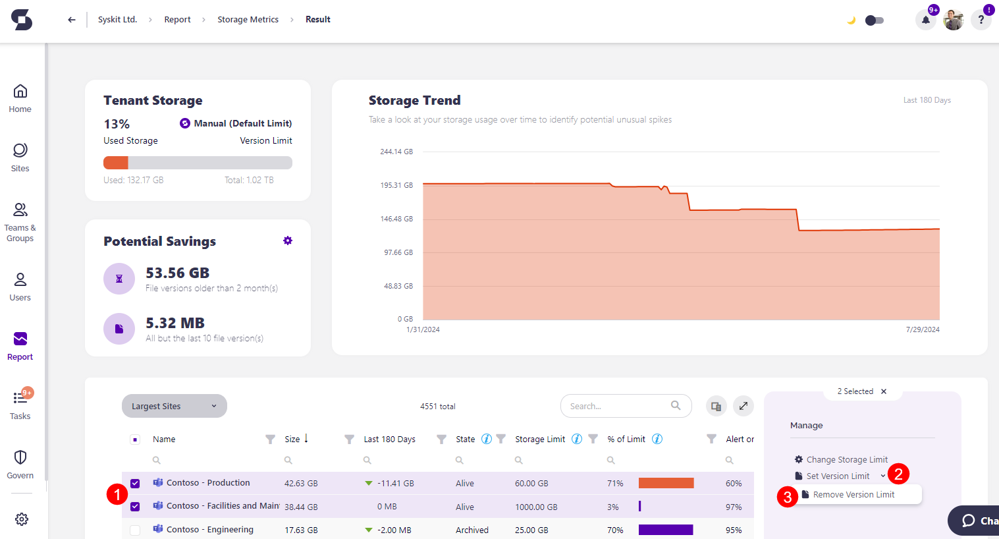
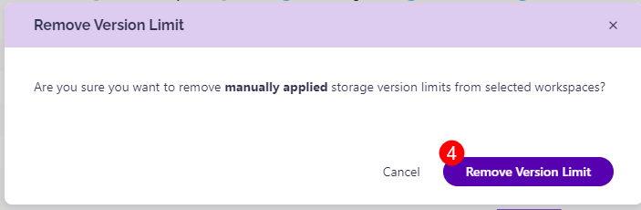

# Storage Versioning Limits  

Having to manually keep up with file versions in your workspaces can be unnecessarily time-consuming. Now, you can **set up versioning limits for your storage**, and automate actions based on the limit settings. 

**Storage Versioning Limits help you limit the number of file versions kept in SharePoint document libraries**. File versions are deleted after exceeding the number of versions you set, the time period you set, or both. 

## Create Storage Versioning Limits

First, go to the **Settings** of your Syskit Point. Click on **Storage Management (1)** and navigate to the **Storage Versioning Limits (2)** section.

There are three default limits set up:
* **Automatic (Default Limit) (3)** - automatically applies optimal storage of versions based on their age and probability of getting restored
* **Inherit Tenant (Default Limit) (4)** - inherits global tenant limit
    * The Automatic and Inherit Tenant limits cannot be edited. 
* **Manual (Default Limit) (5)** - Manual cleanup that runs daily with 100 count limit and 180 day(s) time limit 
    * The Manual limit can be **edited (6)** to adjust the count and time limits based on your personal preferences. 

To create a new storage versioning limit, click the **Create New Limit (6)** button. 

The Create New Manual Storage Limit pop-up opens. There, you can select:
* **Limit Name (1)** - here, you should enter the name for the versioning limit 
* **Count Limit (2)** - select the checkbox if you want to place a count limit on your workspaces
    * Select the **count limit (3)** you want to place as the maximum limit for the number of versions a file can have
    * Once a file exceeds the number of versions you place, the oldest versions start getting removed
* **Time Limit (4)** - select the checkbox if you want to place a time limit on your workspaces
    * Select the **time limit (5)** you want to place as the maximum limit for how old a version can be before getting removed
    * File versions older than the time limit you set get removed once the threshold you set is passed. 
* **Click Save (6)** to finalize your selection and create the new storage versioning limit. 

 

**Please note** that the **manual storage limit runs daily**.  


## Apply Storage Versioning Limits

Once you have created your storage versioning limits, **you can apply them manually** by selecting the workspaces yourself or **automatically** by creating a rule that continuously applies limits to existing and new workspaces that get created.

### **Apply Automatically with Rules**

* Selecting this redirects you to **Rules**, where you can create rules that will continually apply the limit to existing and new workspaces.
* [For details on how to create Rules, take a look at this article.](../governance-and-automation/automated-workflows/policy-automation.md)

### **Manually Apply Limits**

Selecting this opens the Storage Metrics report where you can:

* **Set Version Limit (Tenant-Wide)(1)** by clicking the button on the right side of the screen.
* **Clicking Set Version** Limit opens the pop-up where you can set the file version limit on the whole tenant for new document libraries.
    * The options available are Automatic & Manual.  
* **Selecting Automatic (2)** means that file versions are deleted based on their activity and age, with the algorithm keeping the most valuable versions.
* **Selecting Manual (3)** means that file versions are deleted after exceeding the set number of versions and/or after a set period of time-based on the metrics you previously set.
    * If you select manual, you can also **select the storage versioning limit (4)** that you want to apply tenant-wide
* **Click Set Version Limit (5)** to finalize your selection and apply the changes. 

* **Set Version Limit** on one or more sites by **select one or more workspaces (1)**.
* Click the **Set Version Limit (2)** button on the right side.

This opens the Set Version Limit pop-up, where you can set the file version limit for all new file versions on the selected workspace(s). 

There, you can decide between Automatic, Manual, or Reset to Tenant Limit. 

* **Selecting Automatic (1)** means that file versions are deleted based on their activity and age, with the algorithm keeping the most valuable versions.
* **Selecting Manual (2)** means that file versions are deleted after exceeding the set number of versions and/or after a set period of time-based on the metrics you previously set.
    * If you select manual, you can also **select the storage versioning limit (3)** that you want to apply tenant-wide
* **Selecting Reset to Tenant Limits (4)** means the workspace(s) inherit the versioning limit policy set at the tenant level.

You can also decide whether you want to **clean up existing file versions (5)** before setting the storage versioning limit. 

* **Select the checkbox (6)** to clean up existing file versions
* After selecting the checkbox, you can **choose the type of file version cleanup (7)**: 
    * Old File Versions - cleans up files older than 2 months
    * Number of Versions - cleans up all but the last 10 file versions
    * All But the Last File Version - cleans up all file versions but the last one
* Finally, **if you want to permanently delete the file versions (8)** and clear the space immediately, you can select the checkbox
* **Click Set Version Limit (9)** to finalize your selection and apply the changes. 

### **Remove Manually Applied Limits**

After manual versioning limits have been applied, they can still be removed from sites.

To remove vesion limits, **open the Storage Metrics report**.
* **Select one or more workspaces (1)** for which you want to remove the manually applied storage version limits.
* On the rigt side of the screen, **click the arrow (2)** next to the Set Version Limit action.
* **Click the Remove Version Limit action (3)** that shows up. 
* This makes a pop-up appear that asks you to confirm your decison to remove manually applied limits by **clicking the Remove Version Limit button (4)**.

