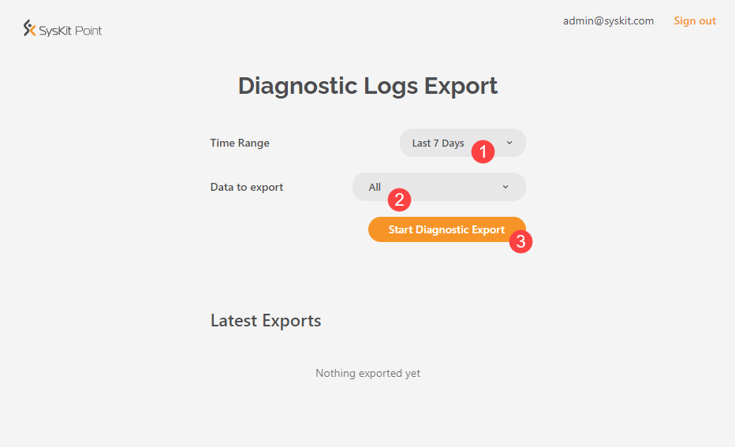
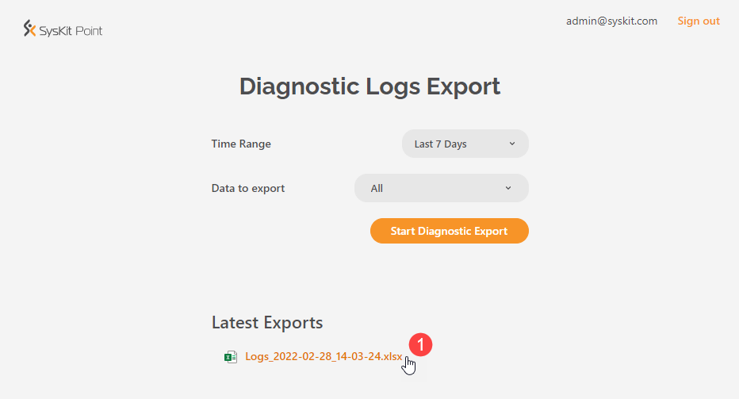

# Export Diagnostic Logs

If you are facing **issues with Syskit Point**, the Syskit Point support team might ask you to **export diagnostic logs to help with troubleshooting**.
This article shows all options when it comes to diagnostic logs export.

## Requirements

To export diagnostic logs, please sign in to Syskit Point with:
* **Syskit Point Admin account**, or
* **Global Administrator account**.


**Please note!**
If you are experiencing **issues with data sync**, **please use the Global Administrator account** to sign in. 
If the user sync is not working correctly, Syskit Point will not resolve user roles. In such cases, only the Global Administrator account has access to the Diagnostic Logs Export screen.


## Export Diagnostic Logs


**Please note!**
After an issue arises, **it can take up to 5 minutes for the related diagnostic log event to be available for export in Syskit Point**.


To export diagnostic logs:
* **Navigate to Settings** > **General** > **About (1)** 
* **Click Diagnostics (2)**; Diagnostic Logs Export screen opens


Alternatively, you can open the Diagnostic Logs Export screen URL directly in your browser. 
To get the Diagnostic Logs Export screen URL, paste `/#/app-diagnostics` text at the end of your Syskit Point URL. for example, `https://point-example.syskit.com/#/app-diagnostics`


On the Diagnostic Logs Export screen:
* **Select the time Range (1)**;there are several predefined options - **Today**, **Yesterday**, **Last 7 Days**, **Last 30 Days** - along with the possibility to select specific start and end dates when choosing the **Custom** option; **by default**, the **Today option is selected**
* **Select Data to Export (2)**; **by default**, **all data types are selected**; use the default selection unless otherwise communicated by the Syskit Point support team
* **Click Start Diagnostic Export** to create a file containing diagnostic logs

When the export is finished:
* **Download link is displayed** in the Latest Exports section
* **Click the Link to download the Excel file (1)**; the download starts automatically

## Next Steps

Once you **download the file**, please **forward it to the Syskit Point support team**.


**Please note!**
If the exported file is larger than 7MB, please [contact us](https://www.syskit.com/contact-us/) to provide you with an upload link.

