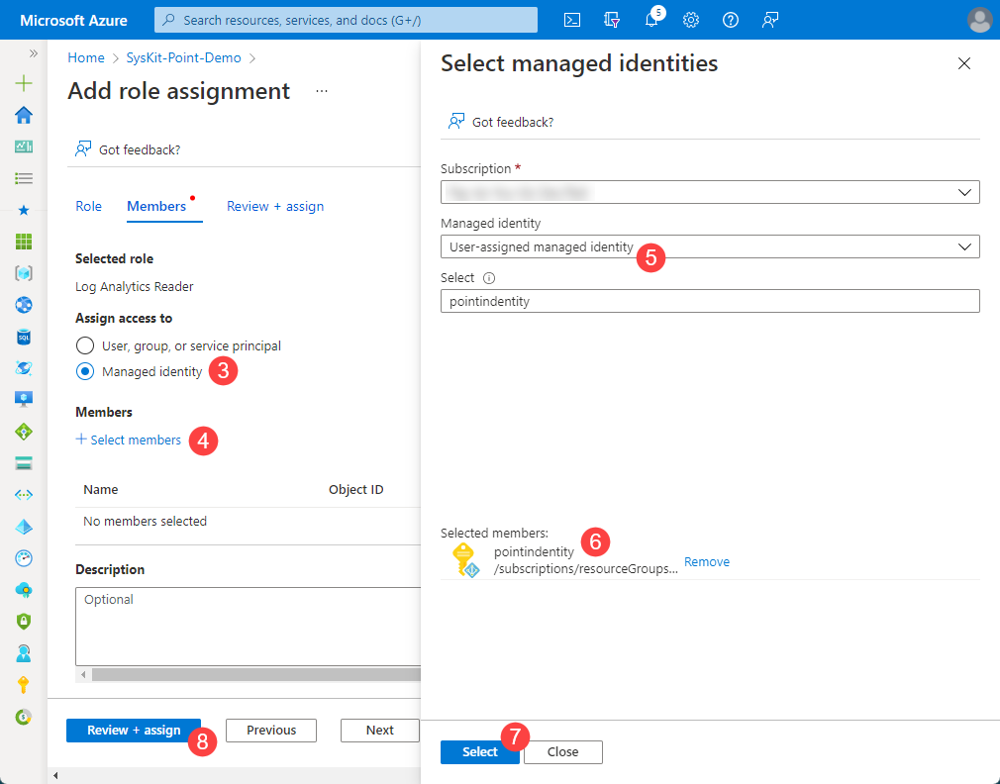

# Setup Diagnostic Logs Export

SysKit Point allows you to export diagnostics logs saved in Application Insights. They contain data that helps the SysKit Point support team resolve issues you might be facing when using SysKit Point. 


**Please note!**
If you are a new customer and deployed **SysKit Point version 2022.2.2 or later**, **all requirements for diagnostic logs export are set up for you automatically**.
**Use the steps described in this article if you are an existing customer upgrading from a previous version to set up diagnostic logs export in SysKit Point manually**.

You will need to set up the following in the SysKit Point Azure resource group:
* **Enable user access to key vault**
* **Create a new key vault secret**
* **Remove user access from the key vault**
* **Assign a role to the user-assigned managed identity**


**Please note!**
To perform changes described in this article, you need to have the owner role assigned on the SysKit Point resource group.

 
## Enable User Access to Key Vault

Before you can create a new key vault secret, enable access to the key vault:
* Open [Azure portal](https://portal.azure.com/) and open resource group where SysKit Point is deployed
* On the resource group **Overview screen**, **find and click the Key Vault resource**
* **Click Access policies (1)** in the Settings section
* **Click Add Access Policy (2)**; the Add access policy screen opens

On the next screen:
* **Select the Secret Management option (1)** in the Configure from the template drop-down
* **Click the None selected link (2)** under Select principal
* **Find and click the currently signed-in user (3)**; the **user is shown in the Selected items section (4)**
* **Click Select (5)**
* **Click Add (6) on the Add access policy screen**; the initial Access Policy screen opens
* **Click Save** on the Access policies screen to save your changes

Next, **allow your IP adress to access the key vault**. On the key vault resource:
* **Navigate to Settings** > **Networking (1)**
* **Enter your IP address (2)**
* **Click Save**

 
## Create a New Key Vault Secret

First, find the Application Insights app ID:
* **Open the Application Insights resource** in SysKit Point resource group
* **Click API Access (1)** under the Configure section
* **Copy and save aside the Application ID (2)**; you will need this value when creating the new key vault secret

Next, create a new key vault secret:
* **Open the Key vault resource**
* **Click Secrets (1)** under the Settings section
* **Click Generate/Import (2)**; **Create a secret** screen opens

On the **Crate a secret** screen:
* **Under Name (1)**, enter the following string: `AppInsightsAppId`
* **Under Value(2)** paste the Application ID that you saved earlier
* **Click Create (3)**

Once the new key vault secret is created, you can remove the previously added access policy and IP address rule to secure the key vault resource.
 
## Remove User Access from Key Vault

First, delete the Access Policy:
* **Open the Key vault resource**
* **Click Access policies (1)** under the Settings section
* **Find your user and click Delete (2)**
* **Click Save (3)**

Next, remove access for your IP address:
* **Open the Key vault resource**
* **Click Networking (2)** under the Settings section
* **Find your IP address and click the delete icon (3)**
* **Click Save**

 
## Assign a Role to the User-Assigned Managed Identity

Last thing left to do is assign 
* **Navigate to SysKit Point resource group**
* **Click Access control (IAM) (1)** in the left menu
* **Add** > **Add role assignment (2)**; **Add role assingment** screen opens

On the **Add role assignment** screen:
* **Find and select the Log Analytics Reader role (1)**
* **Click Next (2)**; **Members tab opens**
* **Select Managed identity (3)** under **Assign access to**
* **Click Select members (4)**
* **Select User-assigned managed identity (5)** under Managed identity
* **Find and click SysKit Point user-assigned managed identitiy (6)**
* **Click select (7)**
* **Click Review + assign (8)** to navigate to the next tab
* **Click Review + assign** again to run the role assignment action

## Next steps

After the setup is complete, diagnostic logs export in SysKit Point should be enabled. 
[To check if the export is working, use the following article explaining how to export diagnostic logs in SysKit Point](export-diagnostic-logs.md).
